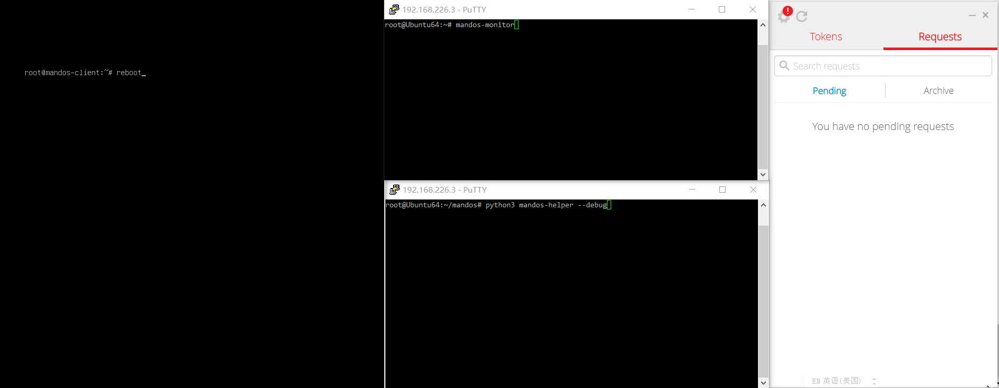

# mandos-helper
Helper scripts that enable remote processing (e.g. on mobile phone) of luks password requests received by Mandos servers.

**Demo of approving mandos client through [Authy OneTouch](https://authy.com/blog/authy-onetouch-modern-authentication-for-any-application/) authentication

