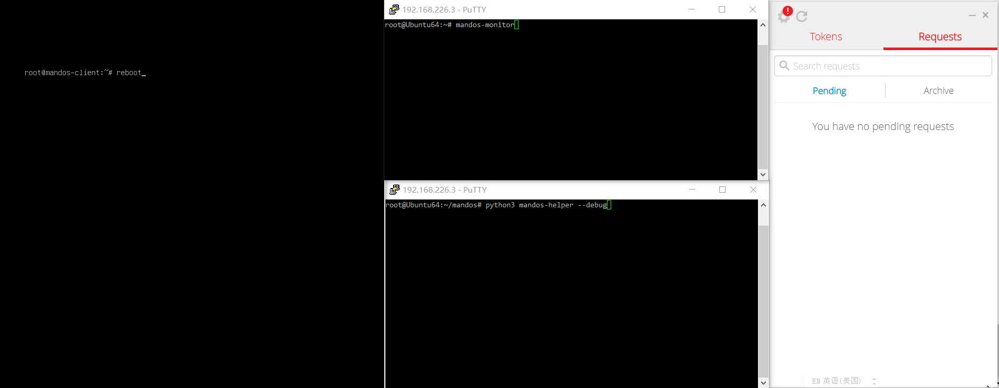
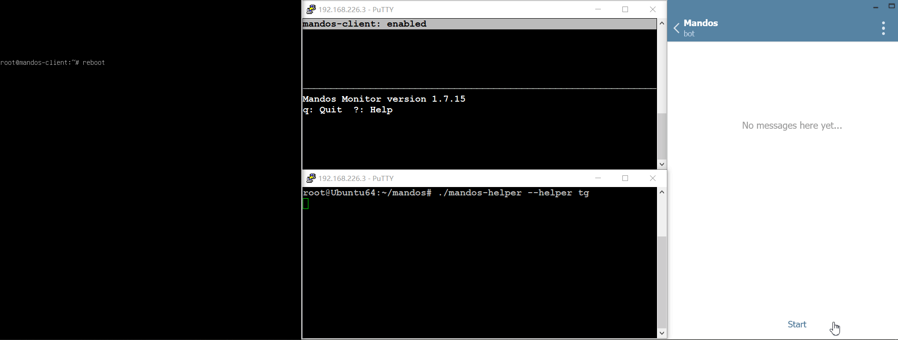

# mandos-helper
Helper scripts that enable remote processing (e.g. on mobile phone) of [luks](https://en.wikipedia.org/wiki/Linux_Unified_Key_Setup) (Linux Unified Key Setup) password requests received by [Mandos server](https://www.recompile.se/mandos).

### Prerequisites
- A working installation of Mandos server: Patching of **mandos** script (usually located at /usr/sbin/) with **mandos_report_ip.diff** is required if IP reporting is needed. The helper needs to be installed on the same machine as Mandos server.
- Python3
- For Authy helper: a [Twillo](https://www.twilio.com) account with a registered authy application.
- For Telegram bot helper: a [Telegram](https://www.telegram.org/) account and a registered bot.

### Usage
1. Clone the git repository, or download and extract the files.
2. Go into the folder and create a virtualenv:
    ```
    python3 -m venv env
    source env/bin/activate
    ```
3. Run `pip3  install -r requirements/authy.txt` or `pip3  install -r requirements/tg.txt` in the folder to install dependencies for respective helper.
4. Modify settings.example.py with relevant settings and save as **settings.py**.
5. To run manually for testing or debugging purpose, just run **mandos-helper**.
6. To run as a systemd service, modify `ExecStart` in **mandos-helper.service** with correct file location and command line arguments, and then:
    ```
    cp mandos-helper.service /etc/systemd/system/
    systemctl enable mandos-helper
    systemctl start mandos-helper
    ```

***

#### Demo of approving mandos client through [Authy OneTouch](https://authy.com/blog/authy-onetouch-modern-authentication-for-any-application/) authentication




#### Demo of approving mandos client through [Telegram bot](https://core.telegram.org/bots)

